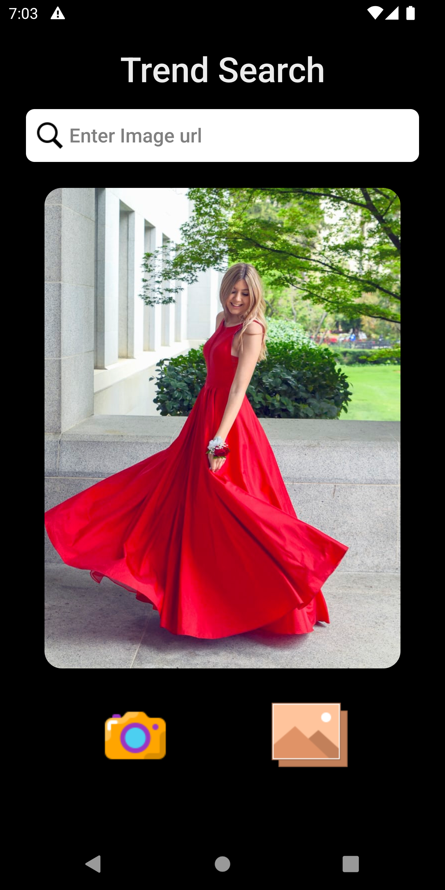

### Trend Search

 A simple Trend Searching Application.

---

## **Problem Statement**

Extract Trends from Social Media Data and Display corresponding searches in Flipkart.

## **Screenshots**

## **Links**

Android [releases](https://drive.google.com/file/d/12kqE_JR1nwDHKNPCObhflDT3SJOcIcsk/view?usp=sharing)
